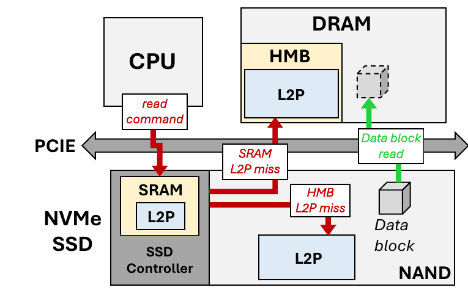
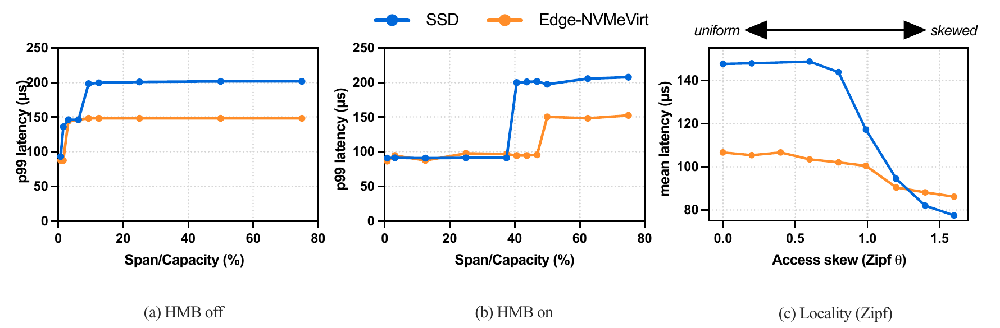
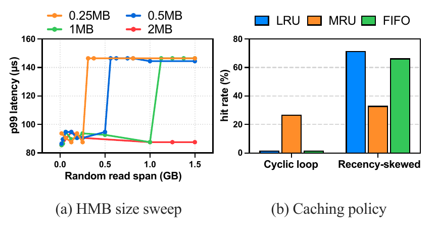

# Edge-NVMeVirt

**Extending NVMeVirt for Edge Storage Research**

Hongseung Yu, Hyunah Kim, Minsung Kim — Seoul National University

> Term project for **Advanced Operating Systems (4190.568), Spring 2026**, Seoul National University
> ([course page](https://csl.snu.ac.kr/courses/4190.568/2026-1/)).
>
> Based on [NVMeVirt](https://github.com/snu-csl/nvmevirt) by SNU CSL ([FAST '23](https://www.usenix.org/conference/fast23/presentation/kim-sang-hoon)).

## Overview

NVMeVirt is a software-defined virtual NVMe SSD implemented as a Linux kernel module. It was built for x86 hosts and server-class SSDs, so it does not match edge storage:

- **Host side:** edge platforms are ARM-based SoCs, but NVMeVirt depends on x86-only boot and interrupt mechanisms.
- **Device side:** edge SSDs are usually **DRAM-less**. They cache only part of the L2P mapping table in controller SRAM and rely on the NVMe **Host Memory Buffer (HMB)**. NVMeVirt assumes the whole L2P table is in on-device DRAM and that lookups are free.

Edge-NVMeVirt addresses both. It ports NVMeVirt to ARM64 and models the HMB-based L2P translation path of DRAM-less SSDs. We evaluated it on a **Jetson Orin Nano** against a real DRAM-less SSD (FORESEE XP1000, 128 GB).

## What's New

### 1. ARM64 port

The core emulation logic is unchanged. Only the platform bring-up path was reworked:

- **Reserved backing memory:** uses a Device Tree `reserved-memory` node (`no-map`) in place of x86 `memmap=` / E820.
- **Synthetic MSI-X delivery:** a software parent IRQ domain plus a PCI-MSI child domain on a synthetic root bus. Completions are delivered through `generic_handle_irq()`, replacing the x86 APIC path.
- **Memory attributes:** the BAR, doorbells and MSI-X table are mapped as MMIO (`ioremap`, `readl`/`writel`). The data backing store stays normal write-back memory.

Details: [`advanced_os/arm64_porting.md`](advanced_os/arm64_porting.md)

### 2. HMB-aware L2P translation cache

<p align="center"></p>

Each read resolves its mapping through three tiers: **controller SRAM → HMB (host DRAM over PCIe) → NAND**. Each tier charges its own latency.

- Two-level cache (SRAM, HMB) at translation-page granularity: one entry covers 1,024 LPNs, or 4 MB of logical space.
- On an SRAM miss with an HMB hit, the entry is promoted to SRAM. On a full miss, the mapping page is fetched from NAND and inserted into HMB.
- Translation delay advances the request's timestamp *before* NAND operations are scheduled. This keeps NVMeVirt's parallel execution model intact.
- With `hmb_size_mb=0`, the model falls back to an SRAM → NAND path (HMB off).
- Replacement policies: **LRU, MRU, FIFO, Random**.

Module parameters:

| Parameter | Description |
|---|---|
| `sram_size_kb` | SRAM tier capacity |
| `hmb_size_mb` / `hmb_size_kb` | HMB tier capacity (0 = HMB disabled) |
| `lat_sram_ns`, `lat_hmb_ns`, `lat_nand_ns` | Per-tier L2P lookup latency |
| `repl_policy` | 0 = LRU, 1 = Random, 2 = MRU, 3 = FIFO |

```bash
sudo insmod nvmev.ko memmap_start=<addr> memmap_size=<size> cpus=<list> \
     sram_size_kb=32 hmb_size_mb=1 repl_policy=0
```

The implementation is in `hmb_cache.c`/`hmb_cache.h`, with hooks in `conv_ftl.c`. Benchmark scripts are in [`advanced_os/`](advanced_os/).

## Results

**Setup:** Jetson Orin Nano (16 GB). All capacities are scaled by 1/64 relative to the target device: a 2 GB virtual SSD, 32 KB SRAM and 1 MB HMB. This keeps the device's ~50% HMB-to-L2P coverage ratio. Workloads are fio 4 KB random reads with `direct=1` at QD1.

### Fidelity against a real DRAM-less SSD



- **(a) HMB off:** p99 latency steps up once the span exceeds SRAM coverage. The emulator reproduces the cliff at the same normalized span.
- **(b) HMB on:** HMB absorbs SRAM misses, so latency stays flat until the span outgrows HMB coverage. Both platforms show this delayed cliff. On the emulator it is a *prediction*, because the HMB latency was calibrated independently.
- **(c) Locality:** as Zipf skew increases, LRU keeps hot entries and mean latency falls, tracking the device's trend.
- **Remaining gaps:**
  - The real device has a higher post-cliff latency, likely from a two-level mapping table on the device.
  - Its HMB cliff comes earlier, likely because part of the HMB is reserved for firmware.

### Exploring the design space



- **(a) HMB size sweep:** HMB size is a fixed on/off switch on the real device. In the emulator, the coverage cliff shifts in proportion to HMB size.
- **(b) Replacement policy:** on a cyclic loop, MRU has the best hit rate. Under a recency-skewed (Zipf 0.99) workload, the order reverses to LRU > FIFO > MRU.

## Building & Usage

The build and setup follow upstream NVMeVirt. See the [original README](https://github.com/snu-csl/nvmevirt#installation). For ARM64, reserve backing memory through the Device Tree instead of `memmap=`. `advanced_os/verify_nvmev_arm64.sh` automates the DTB patch and the load/IO verification.

## Acknowledgements

This project builds on [NVMeVirt](https://github.com/snu-csl/nvmevirt) (GPL-2.0):

```
@InProceedings{NVMeVirt:FAST23,
  author    = {Sang-Hoon Kim and Jaehoon Shim and Euidong Lee and Seongyeop Jeong and Ilkueon Kang and Jin-Soo Kim},
  title     = {{NVMeVirt}: A Versatile Software-defined Virtual {NVMe} Device},
  booktitle = {Proceedings of the 21st USENIX Conference on File and Storage Technologies (USENIX FAST)},
  year      = {2023},
}
```
